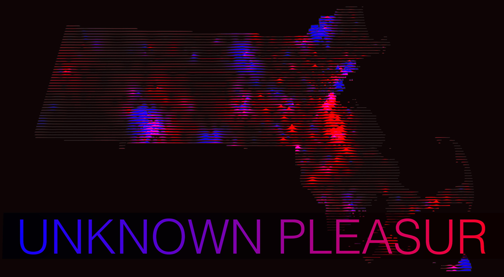

# Unknown Pleasures



Generates regular section cuts through a raster surface for a given extent. Produces results that look quite a lot like the cover of Joy Division's _Unknown Pleasures_ (1979). Also quite a lot like some of the work of the Harvard Laboratory for Computer Graphics and Spaital Analysis (RIP). Also, scholarly integrity requires that I say: [James Cheshire got here first.](https://jcheshire.com/resources/joy-division-population-surfaces-and-pioneering-electronic-cartography/)

General workflow looks like the below. (For a more thoroughly fleshed out example using real data, see `example.R`.) Assuming an `sf` dataframe containing polygons or multipolygons (`tracts`) and a raster surface (`raster`), this generates regularly spaced lines (`st_regular_lines`) and effecitvely "drapes" them over a raster surface, returning polygonal section cuts.

```r
lines <- tracts %>%
  st_union() %>%
  st_regular_lines(
    n = 100,
    mask = TRUE,
    type = "horizontal"
  )

black_renters <- lines %>%
  st_unknown_pleasures(
    raster_black_renters, 
    n = 100, 
    sample_size = 500, 
    bleed_factor = 2
  )
```
